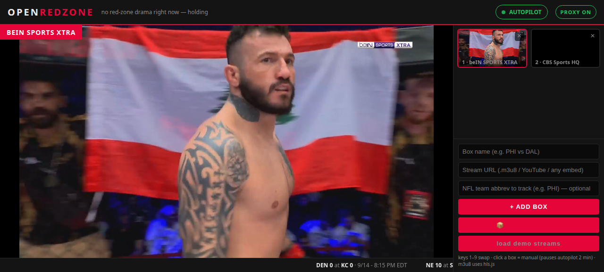

# 🏈 OPEN ZONE

**An open-source, self-hosted RedZone-style multiview.** Every box is your own source — any HLS stream, YouTube live, or embeddable URL — and an autopilot brain jumps the main stage to wherever the action is. NFL Sundays, fight nights, whatever's on.



## Why

NFL RedZone's magic isn't the video — it's the switching brain: always showing whichever game is closest to scoring. Open Zone recreates that with **your** sources and **zero paid services**:

- **Grid of boxes** — each box plays any stream you point it at (.m3u8 via hls.js, YouTube live embeds, any iframe URL)
- **Autopilot** — polls ESPN's free scoreboard API every 15s, computes an "excitement score" per live game (red zone +60, one-score game +25, 4th down +20), and auto-swaps the main stage to the hottest one
- **Manual always wins** — click a box or press `1`–`9`; autopilot pauses for 2 minutes
- **Source packs** — paste any M3U playlist URL (e.g. [iptv-org](https://github.com/iptv-org/iptv)), browse/search channels, tap to box them
- **CORS-unlocking proxy** — the built-in server rewrites manifests and streams segments through itself, so cross-origin-blocked channels play anyway
- **LAN-ready** — host-aware proxy rewriting means phones/TVs on your network get working stream URLs automatically
- **League-wide ticker** — every NFL score, red-zone games flagged, scrolling RedZone-style

No accounts, no API keys, no build step. One HTML file + one small Python server.

## Quickstart

Requires Python 3.8+. No dependencies.

```bash
git clone https://github.com/KGthePM/open-zone.git
cd open-zone
python3 server.py 8790
```

Open `http://localhost:8790`.

To watch from other devices on your network (phone, TV), find the host machine's IP and browse to `http://<ip>:8790` — the proxy handles the rest.

## How to use it

1. **Add boxes** — use the form (name + stream URL, optionally an NFL team abbrev like `PHI` for autopilot tracking), or tap **📦 SOURCE PACKS** to load an M3U playlist and tap channels to box them
2. **Tag teams** — boxes tagged with a team abbrev get linked to live ESPN game data: score overlay, red-zone highlight, autopilot candidacy
3. **Leave autopilot on** — the main stage follows the drama. Click any box or press `1`–`9` to take over; autopilot resumes after 2 minutes
4. **Toggle PROXY** (top right) if a channel misbehaves — ON routes HLS through the local proxy (fixes most CORS-blocked channels)

## How it works

```
┌────────────────────────────────────────────────┐
│                  index.html                    │
│                                                │
│  boxes ──► hls.js / iframe ──► grid + stage    │
│    │                                           │
│    └── M3U packs ──► tap to box                │
└──────────────┬─────────────────┬───────────────┘
               │ fetch 15s        │ /proxy?url=…
               ▼                  ▼
   ESPN free scoreboard    server.py proxy
   (scores, red zone,      (CORS unlock, manifest
    down & distance)        rewriting, LAN-safe)
```

- **Excitement score** ranks live games: any live game +10, within one score +25, within a field goal +15, red zone +60, 4th down +20, 3rd-and-short +10. Autopilot swaps when a game crosses the threshold.
- **Proxy** fetches upstream HLS, rewrites every variant/segment/key URL back through itself using the requesting client's `Host` header, and adds permissive CORS. This is what makes blocked channels playable — and what makes it work from any LAN device.
- **DOM-diff rendering** — score polls update overlays without recreating `<video>` elements, so streams never restart mid-play.

## Source packs

Any M3U/M3U8 playlist works. Good starting points:

- `https://iptv-org.github.io/iptv/categories/sports.m3u` — 400+ sports channels (pre-filled)
- `https://iptv-org.github.io/iptv/index.country.m3u` — country packs
- Your own playlists — HDHomeRun exports, Plex/Stirr aggregators, anything M3U

Reality check: free channel lists have churn. Some channels are dead, geo-blocked, or HEVC-only at any given moment. If a box stays black, kill it (`✕`) and try another.

## Notes & limits

- Videos autoplay muted (browser policy) — click a video for audio
- HEVC (H.265) streams need an HEVC-capable browser/device; hls.js will throw `manifestIncompatibleCodecsError` otherwise
- ESPN data uses the browser-facing `site.web.api.espn.com` host — the plain `site.api.espn.com` blocks browser fetches
- Boxes are stored per-browser (localStorage) — each device keeps its own setup

## License

MIT — see [LICENSE](LICENSE).

---

*Not affiliated with the NFL or NFL RedZone. Use sources you have the right to watch.*
